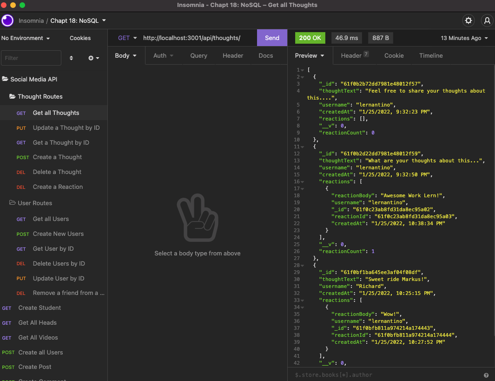
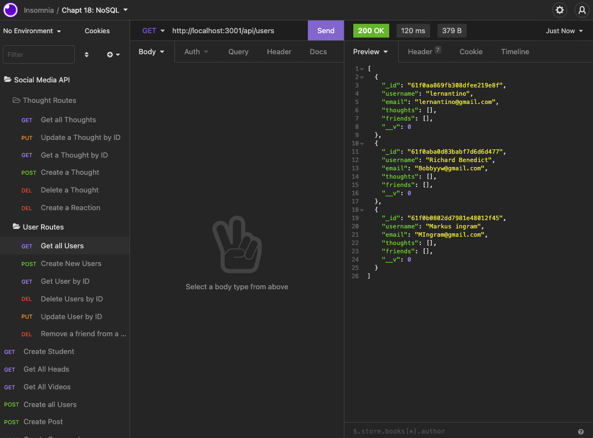

# Chapter 18: Social-Network-API

### by: Yonas Woldemichael
_

## Social Network API
In this assignment I was assigned with building an API for a social network web application.
_

## Table of Contents
 - [Description](#description)
 - [Visuals](#visuals)
 - [Contributors](#Contributors)

 ## Description
Build an API for a social network web application where users can share their thoughts, react to friends’ thoughts, and create a friend list. You’ll use Express.js for routing, a MongoDB database, and the Mongoose ODM. In addition to using the [Express.js](https://www.npmjs.com/package/express) and [Mongoose](https://www.npmjs.com/package/mongoose) packages, you may also optionally use a JavaScript date library of your choice or the native JavaScript `Date` object to format timestamps.No seed data is provided, so you’ll need to create your own data using Insomnia after you’ve created your API.

 ## Apps Used
- Express.js will be used
- MongoDB will be used
- Javascript
- Both GET, PUT, DELETE and POST routes were used for retrieving data,

 ## Visuals

Here are screenshots of the Insomnia routes running

#

# Contributors

Yonas Woldemichael
- [Github](https://github.com/Ybyonas1/social-network-api)